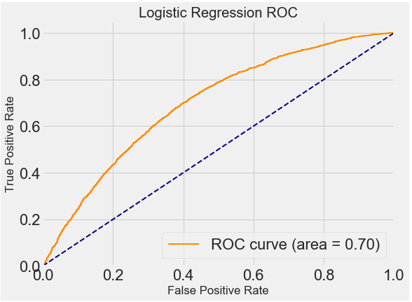

# LoanDefault_prediction Project  

## For **reproduce**:
- Data file need to be download from kaggle https://www.kaggle.com/c/loan-default-prediction
- Output file contain the ROC curve of the project

## Overview
This data corresponds to a set of financial transactions associated with individuals. The data has been standardized, de-trended, and anonymized. You are provided with over two hundred thousand observations and nearly 800 features.  Each observation is independent from the previous. 

For each observation, it was recorded whether a default was triggered. In case of a default, the loss was measured. This quantity lies between 0 and 100. It has been normalised, considering that the notional of each transaction at inception is 100. For example, a loss of 60 means that only 40 is reimbursed. If the loan did not default, the loss was 0. You are asked to predict the losses for each observation in the test set.

Missing feature values have been kept as is, so that the competing teams can really use the maximum data available, implementing a strategy to fill the gaps if desired. Note that some variables may be categorical (e.g. f776 and f777).

The competition sponsor has worked to remove time-dimensionality from the data. However, the observations are still listed in order from old to new in the training set. In the test set they are in random order.

The **GOALS** of this project are to:
- Use different Linear and Nonlinear classification model including Logistic Regression and Random Forest to detect default.
- Learn the metric (ROC)
- Nonlinear model and linear model need different way of feature selection

**Tools:**
- Python

